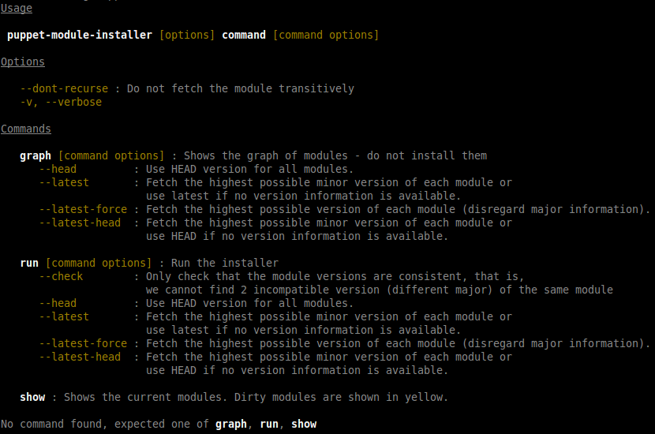

# Command Line Interface Scala Toolkit
[](https://travis-ci.org/backuity/clist)
[](https://maven-badges.herokuapp.com/maven-central/org.backuity.clist/clist-core_2.11)
[](https://maven-badges.herokuapp.com/maven-central/org.backuity.clist/clist-core_2.12)

The Backuity CLIST is a scala-only (2.11+) library for quickly building beautiful type-safe modular and reusable mutable CLIs.

- [You said beautiful](#you-said-beautiful)
- [Why mutable?](#why-mutable)
- [Let's start - Single Command CLI](#lets-start---single-command-cli)
- [Attributes: Argument vs Arguments vs Options](#attributes-argument-vs-arguments-vs-option)
- [Parsing](#parsing)
- [Exit code vs Exception](#exit-code-vs-exception)
- [Version, Help and Usage](#version-help-and-usage)
- [Multiple Commands](#multiple-commands)
  - [Composition: grouping Options into Traits](#composition-grouping-options-into-traits)
  - [Adding behavior to Commands](#adding-behavior-to-commands)
- [Licence & Contribution](#licence--contribution)

## You said beautiful?

An image is worth a thousand words, here is a taste of what you'd get for free:



## Why mutable?

We think that CLIs do not require an immutable approach. Immutability often comes at the expense of simplicity.
If you are looking for an immutable CLI library you should take a look at projects like https://github.com/scopt/scopt.

## Let's start - Single Command CLI

First let's configure our SBT build
```scala
libraryDependencies ++= Seq(
   "org.backuity.clist" %% "clist-core"   % "3.4.0",
   "org.backuity.clist" %% "clist-macros" % "3.4.0" % "provided")
```

Then define a command:
```scala

  import org.backuity.clist._
  // or if you do not like wildcard imports:
  // import org.backuity.clist.{Command, opt, args}

  class Cat extends Command(description = "concatenate files and print on the standard output") {

    // `opt`, `arg` and `args` are scala macros that will extract the name of the member
    // to use it as the option/arguments name.
    // Here for instance the member `showAll` will be turned into the option `--show-all`
    var showAll        = opt[Boolean](abbrev = "A", description = "equivalent to -vET")

    // an abbreviated form can be added, so that this option can be triggered both by `--number-nonblank` or `-b`
    var numberNonblank = opt[Boolean](abbrev = "b", description = "number nonempty output lines, overrides -n")

    // default values can be provided
    var maxLines       = opt[Int](default = 123)

    var files          = args[Seq[File]](description = "files to concat")
  }
```

And use it to parse `args`:
```scala
  def main(args: Array[String]) {
    Cli.parse(args).withCommand(new Cat) { case cat =>
          // the new Cat instance will be mutated to receive the command-line arguments
          println(cat.files)
      }
  }
```

Alternatively for simple commands like this one you can simply extend `CliMain` thus reducing the boiler plate even further:
```scala
import java.io.File

import org.backuity.clist._

object CatDemo extends CliMain[Unit](
  name = "cat",
  description = "concatenate files and print on the standard output") {

  var showAll        = opt[Boolean](abbrev = "A", description = "equivalent to -vET")
  var numberNonblank = opt[Boolean](abbrev = "b", description = "number nonempty output lines, overrides -n")
  var maxLines       = opt[Int](default = 123)
  var files          = args[Seq[File]](description = "files to concat")

  def run: Unit = {
    println("files    = " + files)
    println("showAll  = " + showAll)
    println("maxLines = " + maxLines)
  }
}
```

## Attributes: Argument vs Arguments vs Option

A `Command` can have 3 kinds of attributes:
  - `opt`: an option is always optional and is provided either by `--option-name=value`,
           or with an abbreviated form such as `-x`.
           Declaration order does not matter.
  - `arg`: an argument receives an un-named value as in the command `cat <file>`. It might be optional.
           Argument declaration order matters.
  - `args`: the equivalent of a var-args. At most one can be specified and it must be declared last.

### Default Option value

An option (being optional) _must_ have a default value (as we want to avoid `null` for obvious reasons).
That default value is automatically provided for `Boolean` and `Option` (respectively `false` and `None`).

Note that a boolean option can be true by default, in that case providing it will make it false:
```scala
var prettyPrint = opt[Boolean](default = true, name = "no-pretty-print")
```
Then on the command line: `cmd --no-pretty-print` will make `prettyPrint` false.


### Abbreviated Option

Currently only boolean are supported.

### Optional Argument

An argument can turned optional by setting the `required` attribute to `false`:

```scala
var target = arg[Option[String]](required = false)
```

Very much like options, optional arguments _must_ provide a default value for types other than `Boolean` and `Option`.

### Named Argument

An argument can be provided through the command line in the same fashion as options.

```scala
var target = arg[String]()
var verbose = opt[Boolean]()
```

Then on the command line: `cmd --verbose --target=stuff`

Note that when doing so its order become irrelevant (the argument can be provided after options/arguments that were declared after him).

## Parsing

The parsing is done through the `Read` and `ReadMultiple` type-classes. User-specific instances can be provided by simply
adding them to the implicit scope.
`Read` (used by `opt` and `arg`) parses a String into a type `T`,
whereas `ReadMultiple` (used by `args`) takes a __list__ of string to produce a type `U`.

The following types are supported out-of-the-box:
  - String
  - Int, Long, Double
  - BigInt, BigDecimal
  - java.util.Calendar (in the `yyyy-MM-dd` format)
  - java.io.File
  - java.net.URI
  - Tuple2
  - java enums

Note that on the command line there is a distinction between
```
cat file1 file2 "file with space"
```
and
```
cat file1 file2 file with space
```

### Example

```scala
var maxDelay = opt[Long](default = 3000L)
var maxError = opt[Double](default = 3.24)
```

Or if you need to customize that parsing:

```scala
object Person extends Command {
  var name = arg[Name]()
}

case class Name(firstName: String, lastName: String)

import org.backuity.clist.util.Read

implicit val nameRead = Read.reads[Name] { str =>
  val Array(first,last) = str.split("\\.")
  Name(first,last)
}
```

## Exit code vs Exception

By default, upon failure, the `Cli` will exit with code 1. This behavior can be customized:
  - `Cli.parse(args).throwExceptionOnError()` : throws an exception instead of exiting
  - `Cli.parse(args).exitCode(12)` : exits with a specific code

## Version, Help and Usage

You can provide a version number for your program through `version("1.0.0")`. This will add a `version` option,
whose name can be customized with `version("1.0.0", "custom-name")`.

By default a help command is added, which displays the command usage. This can be removed with `noHelp()`.
The usage is printed for each parsing error but this can be disabled with `noUsageOnError()`.

Finally the usage can be customized through `withUsage(newCustomUsage)`.

## Multiple Commands

To build a multi-command CLI simply provide the parser with more than one command:
```scala
object Run extends Command
object Show extends Command

val res = Cli.parse(args).withCommands(Run, Show)
// res will be an Option[Command]
```

It makes sense now to define a name for our program:
```scala
Cli.parse(args).withProgramName("my-cli").withCommands(Run, Show)
```

### Composition: grouping Options into Traits

It is entirely possible (and encouraged) to factorize options into traits and compose Commands with them:
```scala
trait Common { this: Command =>
   var verbose = opt[Boolean](abbrev = "v")
}

object Run extends Command with Common
object Show extends Command with Common

val res = Cli.parse(args).withCommands(Run, Show)
// res is also now inferred as an `Option[Common]`
```

You can also seal your command hierarchy to allow exhaustive pattern matching checks:
```scala
sealed trait Common { this: Command => // same as above
}

Cli.parse(args).withCommands(Run, Show) match {
   case Some(Run)  =>
   case Some(Show) =>
   case None =>
}
```

### Adding behavior to Commands

Depending on your taste, you might want to define the behavior of your commands within them:
```scala
sealed trait Common { this: Command =>
   var verbose = opt[Boolean](abbrev = "v")
   def run(): Unit
}

object Run extends Command with Common {
   def run(): Unit = {
      println("Running...")
   }
}

object Show extends Command with Common {
   def run(): Unit = {
      println("Showing...")
   }
}

Cli.parse(args).withCommands(Run, Show).foreach(_.run())
```

## Licence & Contribution

The code is published under the Apache 2.0 licence.

You're welcome to fork and submit PRs, and if you like the project you can up-vote the related
[StackOverflow answer](http://stackoverflow.com/questions/2315912/scala-best-way-to-parse-command-line-parameters-cli/34748336#34748336).
